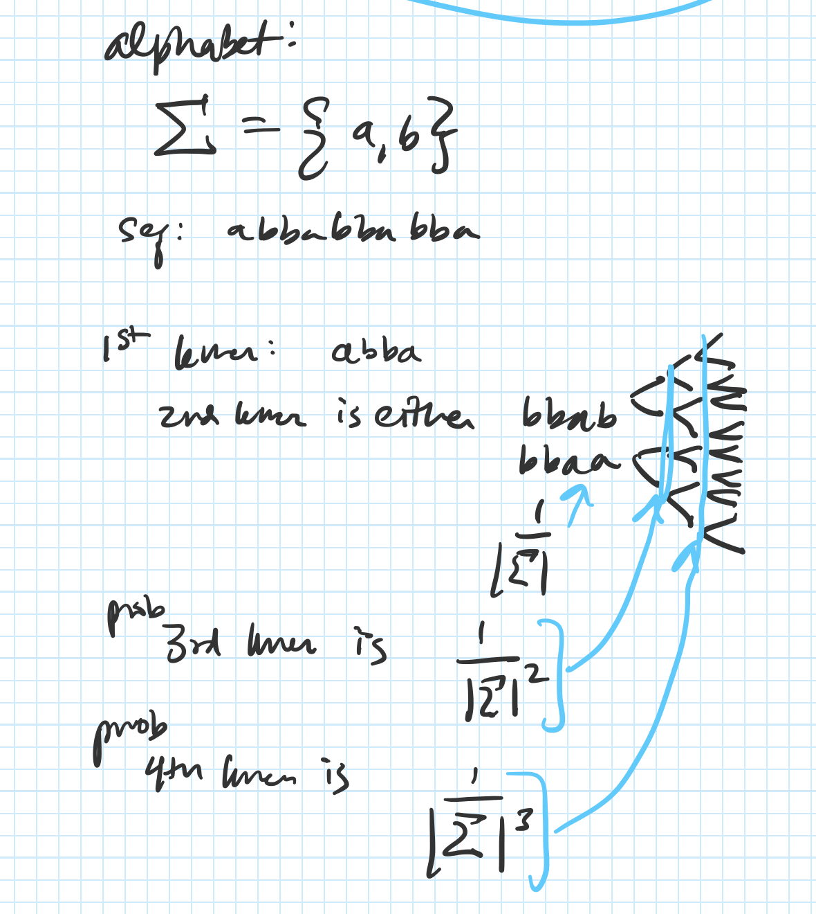

## Implementation

### Reduced alphabets

At the core of `kmerslay` is the ability to cheaply compare sequences using $k$-mers.
As $k$-mers are very brittle to substitutions and thus to compare across species, one must allow for minor base substitutions that still maintain similar chemical or structural properties.
A reduced alphabet can encode useful information into a smaller alphabet space, and enable sequence comparisons across a broader variety of species than the original alphabet alone.


#### Reduced amino acid alphabets

Reduced amino acid alphabets have been useful for over 50 years [@raw:dayhoff1969atlas] in finding related protein sequences [@doi:10.1093/bioinformatics/btp164; @doi:10.1093/bioinformatics/10.4.453; @doi:10.1186/1471-2105-12-159; @doi:10.1093/protein/13.3.149; @doi:10.1093/nar/gkh180].
Recently, a reduced amino acid alphabet (specifically, `aa9` below) combined with $k$-mers were used to find homologous protein-coding sequences [@doi:10.1093/gigascience/giz118].
We build on this concept by enabling prediction of protein-coding sequences from RNA-seq reads, and by enabling users to perform a parameter sweep in an all-by-all comparison to identify putative homologs using a variety of alphabet metrics.


##### Dayhoff and `HP` alphabets

| Amino acid              | Property              | Dayhoff | Hydrophobic-polar (HP)  |
|:------------------------|:----------------------|:--------|:------------------------|
| `C`                     | Sulfur polymerization | `a`     | `p`                     |
| `A`, `G`, `P`, `S`, `T` | Small                 | `b`     | `AGP`: `h`<br>`ST`: `p` |
| `D`, `E`, `N`, `Q`      | Acid and amide        | `c`     | `p`                     |
| `H`, `K`, `R`           | Basic                 | `d`     | `p`                     |
| `I`, `L`, `M`, `V`      | Hydrophobic           | `e`     | `h`                     |
| `F`, `W`, `Y`           | Aromatic              | `f`     | `h`                     |


Table: Dayhoff and hydrophobic-polar encodings are a reduced amino acid
alphabet allowing for permissive cross-species sequence comparisons. For
example, the amino acid sequence `SASHAFIERCE` would be Dayhoff-encoded
to `bbbdbfecdac`, and HP-encoded to `phpphhhpppp`, as below. {#tbl:sequence-encodings}


```
protein20: SASHAFIERCE
dayhoff6:  bbbdbfecdac
hp2:       phpphhhpppp
```


##### All implemented alphabets (with citations, not as nicely organized)
<!-- Copied this google spreadsheet https://docs.google.com/spreadsheets/d/1RDuQD0aRyv-FnQJbjRosHEJV85_9BNrzmmvgFRQSgN8/edit#gid=0 into https://thisdavej.com/copy-table-in-excel-and-paste-as-a-markdown-table/, reformatted with https://atom.io/packages/markdown-table-formatter -->

[NOTE: maybe this should go into the supplementary? The main alphabets that have been successful for me are dayhoff and HP]

| Citation                                                              | Alphabet   | Amino acid groups                                                               |
|:-----------------------------------------------------|:-------------------|:-----------------------------------------------------------------------------------------|
| Phillips, R., *et al*. (2012). [@raw:phillips2012physical]            | hp2        | `AFGILMPVWY` `CDEHKNQRST`                                                       |
| Peterson, E. L., *et al*. (2009) [@doi:10.1093/bioinformatics/btp164] | gbmr4      | `G` `ADKERNTSQ` `YFLIVMCWH` `P`                                                 |
| Dayhoff, M. O., & Eck, R. V. (1968). [@raw:dayhoff1969atlas]          | dayhoff6   | `AGPST` `HRK` `DENQ` `FWY` `ILMV` `C`                                           |
| This paper                                                            | botvinnik8 | `AG` `DE` `RK` `NQ` `ST` `FY` `LIV` `CMWHP`                                     |
| Hu, X., & Friedberg, I. (2019). [@doi:10.1093/gigascience/giz118]     | aa9        | `G` `AST` `KR` `EQ` `DN` `CFILMVY` `W` `H` `P`                                  |
| Peterson, E. L., *et al*. (2009) [@doi:10.1093/bioinformatics/btp164] | sdm12      | `G` `A` `D` `KER` `N` `TSQ` `YF` `LIVM` `C` `W` `H` `P`                         |
| Peterson, E. L., *et al*. (2009) [@doi:10.1093/bioinformatics/btp164] | hsdm17     | `G` `A` `D` `KE` `R` `N` `T` `S` `Q` `Y` `F` `LIV` `M` `C` `W` `H` `P`          |
| Dayhoff, M. O., & Eck, R. V. (1968). [@raw:dayhoff1969atlas]          | protein20  | `G` `A` `D` `E` `K` `R` `N` `T` `S` `Q` `Y` `F` `L` `I` `V` `M` `C` `W` `H` `P` |


#### Reduced nucleotide alphabets

The IUPAC degenerate nucleotide code [@url:https://www.qmul.ac.uk/sbcs/iubmb/misc/naseq.html] includes several two-letter codes for the original 4-letter nucleobase alphabet.
The first, Weak/Strong, indicates the strength of the hydrogen bond across the double strand.
The bond of adenine to thymine has two hydrogen bonds, making it weak; and the bond of guanine to cytosine has three hydrogen bonds, making it 50% stronger.
The second, Purine/Pyrimidine, encodes the ring size of the nucleobase, where Adenine and Guanine both have larger Purine double rings, while Cytosine and Thymine/Uracil have smaller Pyrimidine rings.
The third, Amino/Keto, designates the main functional group of the ring, where Adenine and Cytosine both have an Amino group, while Guanine and Thymine/Uracil both have a Keto group.

<!-- This spreadsheet:https://docs.google.com/spreadsheets/d/1RDuQD0aRyv-FnQJbjRosHEJV85_9BNrzmmvgFRQSgN8/edit#gid=104831627 was copied into this formatter: https://thisdavej.com/copy-table-in-excel-and-paste-as-a-markdown-table/ -->

| Nucleotide | Hydrogen Bonding | Ring type      | Ring functional group | Nucleobase chemical structure                                                                                                                                   |
|:-----------|:-----------------|:---------------|:----------------------|:------------------------------------------------|
| A          | Weak (W)         | Purine (R)     | Amino (M)             |                                       |
| C          | Strong (S)       | Pyrimidine (Y) | Amino (M)             |  |
| G          | Strong (S)       | Purine (R)     | Keto (K)              |                                         |
| T          | Weak (W)         | Pyrimidine (Y) | Keto (K)              |                     |
| U          | Weak (W)         | Pyrimidine (Y) | Keto (K)              |                                          |
Thus, the nucleotide string `GATTACA` would be re-encoded into the following:

```
Nucleotide:        GATTACA
Weak/Strong:       SWWWWSW
Purine/Pyrimidine: RRYYRYR
Functional group:  KMKKMMM
```

### `kmerslay extract-coding`


![Overview of `kmerslay extract-coding` **A.** First, each read is translated into all six possible protein-coding translation frames. Next, reading frames with stop codons are eliminated. Each protein-coding frame is $k$-merized, then the fraction of $k$-mers which appear in the known protein-coding database is computed. Frames which contain a fraction of coding frames exceeding the threshold are inferred to be putatively protein-coding. **B.** Worked example of an RNA-seq read with a single putatitive reading frame. **C.** Worked example of an RNA-seq read with multiple reading frames, and a `UCSC` genome browser shot of the read showing that both reading frames are present in the annotation.](images/SVG/figure1.svg){#sfig:figure1 tag="figure1" width="100%"}


#### Set Jaccard threshold of `extract-coding` by controlling false positive rate of protein-coding prediction

To set a threshold of the minimum Jaccard overlap between a translated read's frame and the reference proteome, the most statistically principled way is to control the false positive rate of predicing a protein-coding read.

##### Probability of random $k$-mers from a read

If $k$-mers from reads were independent, identically distributed (i.i.d.) variables, then a translated read of length $L_{\mathrm{translated}}$ drawing letters from the alphabet $\Sigma$, whose size is $|\Sigma|$, would contain

$$\left( \frac{1}{\left| \Sigma \right|^k} \right)^{L_{\mathrm{translated}} - k + 1}$$ {#eq:n_kmers_per_read_iid}

However, $k$-mers drawn from reads are not i.i.d.
Let's take a simple example.
If we have a two-letter alphabet, $\Sigma = \\{a, b\\},$, thus $|\Sigma| = 2$.
Let us use an example sequence $S = abbabba$.
If $k = 4$, then the first $k$-mer is $abba$.
The second $k$-mer is thus either $bbaa$ or $bbab$, with equal probability.
We can generalize this: Given the first $k$-mer, the first $k-1$ letters from the second $k$-mer are known, and thus the probability of guessing the next $k$-mer is $\frac{1}{\left|\Sigma\right|}$.

{#sfig:prob_kmers_in_read tag="prob_kmers_in_read" width="50%"}

Thus, the probability of a random $k$-mer from a sequencing read is completely dependent on the alphabet size $|\Sigma|$ and its translated sequence length, $L_{\mathrm{translated}}$:

$$
\begin{align}
\mathrm{Pr}(\mathrm{FPR}) &= \left(\frac{1}{|\Sigma|}\right)^k \times \left( \frac{1}{|\Sigma|} \right)^{L_{\mathrm{translated}} - k }\\
&=\frac{1}{| \Sigma |^k  \times |\Sigma|^{L_{\mathrm{translated} - k} }}\\
&= \frac{1}{| \Sigma|^{L_{\mathrm{translated}}}}
\end{align}
$$ {#eq:prob_kmers_in_read}

##### Bloom filter collision probability

The probability of error of the `khmer` bloom filter implementation [@doi:10.1371/journal.pone.0101271] used in `kmerslay`, given $N$ distinct $k$-mers counted, a hash table size of $H$, and $Z$ total number of hash tables, is

$$\mathrm{Pr}(\mathrm{FPR}_{\mathrm{bloom}}) = \left( 1 - \exp^{N/H}\right)^Z.$$ {#eq:bloom_filter_fpr}

Theoretically, the total number of $k$-mers is limited by the alphabet size and choice of $k$.
Empirically, the number of possible $k$-mers is limited by the $k$-mers which are compatible with life, and by $k=5$, the number of theoretical protein $k$-mers exceeds the number of observed protein $k$-mers.
Additionally, the mass of all possible $k$-mers of a certain size, exceeds the mass of the planet earth by $k = X$ [get the data for this].
The UniProtKB Opisthokonta manually reviewed dataset contains $4.8 \times 10^7$ $7$-mers in the protein alphabet.
Thus, we can give an upper bound to the number of theoretical $k$-mers to be $10^8$.
Therefore, the total number of $k$-mers in the bloom filter is,

$$N = \min\left( 10^8, |\Sigma|^k \right).$$ {#eq:n_proteome_kmers}


##### False positive rate of protein-coding prediction

Combining Equations @eq:prob_kmers_in_read, @eq:n_proteome_kmers, and @eq:bloom_filter_fpr, for an RNA-seq read of length $L$ where its translated length $L_{\mathrm{translated}} = \lfloor \frac{L}{3} \rfloor$, containing a possible six frames of translation, then the false-positive rate (FPR) protein-coding read is,

$$
\begin{align}
\mathrm{Pr}\left(\mathrm{FPR}\right) &=
6 \times \left( 1 - \exp^{\min\left( 10^8, |\Sigma|^k \right)} \right)^Z \times \frac{1}{\left| \Sigma \right|^{L_{\mathrm{translated}}}}.
\end{align}
$$  {#eq:fpr_protein_coding}

#### Similarity thresholds for percentage of matching $k$-mers

A single SNP in a read affects $k$ $k$-mers.

### `kmerslay compare-kmer-content` performs all-by-all or pairwise k-mer similarity of protein or nucleotide sequences using reduced alphabets

![Overview of `kmerslay compare-kmer-content` **A.** Protein sequences are $k$-merized by converting into a bag of words using a sliding window of size $k$, potentially re-encoded to a lossy alphabet, and then their fraction of overlapping $k$-mers is computed into a Jaccard similarity. **B.** One option for `kmerslay compare-kmer-content` is to specify a pair of sequence files, and compute a background of $k$-mer similarty using randomly shuffled pairs. **C.** Another option for `kmerslay compare-kmer-content` is to do an all-by-all $k$-mer similarity comparison.](images/SVG/figure3.svg){#sfig:figure3 tag="figure3" width="100%"}
