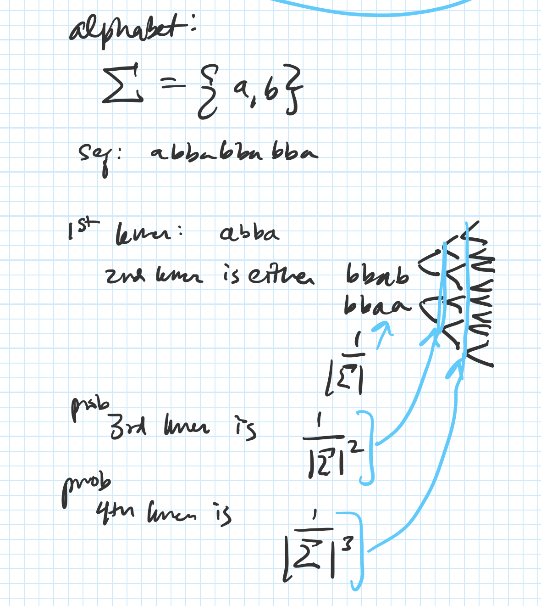

---
author-meta:
- Olga Borisovna Botvinnik
- N. Tessa Pierce
bibliography:
- content/manual-references.json
date-meta: '2020-03-17'
header-includes: '<!--

  Manubot generated metadata rendered from header-includes-template.html.

  Suggest improvements at https://github.com/manubot/manubot/blob/master/manubot/process/header-includes-template.html

  -->

  <meta name="dc.format" content="text/html" />

  <meta name="dc.title" content="INCOMPLETE DRAFT: RNA --k-mers--&gt; Protein" />

  <meta name="citation_title" content="INCOMPLETE DRAFT: RNA --k-mers--&gt; Protein" />

  <meta property="og:title" content="INCOMPLETE DRAFT: RNA --k-mers--&gt; Protein" />

  <meta property="twitter:title" content="INCOMPLETE DRAFT: RNA --k-mers--&gt; Protein" />

  <meta name="dc.date" content="2020-03-17" />

  <meta name="citation_publication_date" content="2020-03-17" />

  <meta name="dc.language" content="en-US" />

  <meta name="citation_language" content="en-US" />

  <meta name="dc.relation.ispartof" content="Manubot" />

  <meta name="dc.publisher" content="Manubot" />

  <meta name="citation_journal_title" content="Manubot" />

  <meta name="citation_technical_report_institution" content="Manubot" />

  <meta name="citation_author" content="Olga Borisovna Botvinnik" />

  <meta name="citation_author_institution" content="Data Sciences Platform, Chan Zuckerberg Biohub" />

  <meta name="citation_author_orcid" content="0000-0003-4412-7970" />

  <meta name="twitter:creator" content="@olgabot" />

  <meta name="citation_author" content="N. Tessa Pierce" />

  <meta name="citation_author_institution" content="Department of Population Health and Reproduction, University of California, Davis" />

  <meta name="citation_author_orcid" content="0000-0002-2942-5331" />

  <link rel="canonical" href="https://czbiohub.github.io/kmerslay-paper/" />

  <meta property="og:url" content="https://czbiohub.github.io/kmerslay-paper/" />

  <meta property="twitter:url" content="https://czbiohub.github.io/kmerslay-paper/" />

  <meta name="citation_fulltext_html_url" content="https://czbiohub.github.io/kmerslay-paper/" />

  <meta name="citation_pdf_url" content="https://czbiohub.github.io/kmerslay-paper/manuscript.pdf" />

  <link rel="alternate" type="application/pdf" href="https://czbiohub.github.io/kmerslay-paper/manuscript.pdf" />

  <link rel="alternate" type="text/html" href="https://czbiohub.github.io/kmerslay-paper/v/735fc3272ef7394e03015a380aeca858a9e274ea/" />

  <meta name="manubot_html_url_versioned" content="https://czbiohub.github.io/kmerslay-paper/v/735fc3272ef7394e03015a380aeca858a9e274ea/" />

  <meta name="manubot_pdf_url_versioned" content="https://czbiohub.github.io/kmerslay-paper/v/735fc3272ef7394e03015a380aeca858a9e274ea/manuscript.pdf" />

  <meta property="og:type" content="article" />

  <meta property="twitter:card" content="summary_large_image" />

  <link rel="icon" type="image/png" sizes="192x192" href="https://manubot.org/favicon-192x192.png" />

  <link rel="mask-icon" href="https://manubot.org/safari-pinned-tab.svg" color="#ad1457" />

  <meta name="theme-color" content="#ad1457" />

  <!-- end Manubot generated metadata -->'
keywords:
- markdown
- publishing
- manubot
lang: en-US
manubot-clear-requests-cache: false
manubot-output-bibliography: output/references.json
manubot-output-citekeys: output/citations.tsv
manubot-requests-cache-path: ci/cache/requests-cache
title: 'INCOMPLETE DRAFT: RNA --k-mers--> Protein'
...


<small><em>
This manuscript
([permalink](https://czbiohub.github.io/kmerslay-paper/v/735fc3272ef7394e03015a380aeca858a9e274ea/))
was automatically generated
from [czbiohub/kmerslay-paper@735fc32](https://github.com/czbiohub/kmerslay-paper/tree/735fc3272ef7394e03015a380aeca858a9e274ea)
on March 17, 2020.
</em></small>

## Authors


+ **Olga Borisovna Botvinnik**<br>
    {.inline_icon}
    [0000-0003-4412-7970](https://orcid.org/0000-0003-4412-7970)
    · {.inline_icon}
    [olgabot](https://github.com/olgabot)
    · {.inline_icon}
    [olgabot](https://twitter.com/olgabot)<br>
  <small>
     Data Sciences Platform, Chan Zuckerberg Biohub
  </small>

+ **N. Tessa Pierce**<br>
    {.inline_icon}
    [0000-0002-2942-5331](https://orcid.org/0000-0002-2942-5331)
    · {.inline_icon}
    [bluegenes](https://github.com/bluegenes)<br>
  <small>
     Department of Population Health and Reproduction, University of California, Davis
     · Funded by NSF 1711984
  </small>


## Abstract

RNA-sequencing is a widely used measure of cellular state, and it is often used as proxy for estimating abundance of protein-coding molecules.
However, the tools to estimate protein-coding sequence from RNA-seq reads don't allow for extraction of protein-coding sequences from distantly related species.
We present `kmerslay`, a suite of $k$-mer based tools to extract protein-coding sequences from RNA-seq reads using reduced amino acid alphabets to allow for flexibility in proteome evolution.
`kmerslay` can also perform all-by-all $k$-mer similarity of sequences in both amino acid and nucleotide reduced alphabets to find clusters of similar sequences which can then be used for homology inference.
By enabling extraction of protein-coding sequences across a wide variety of species, `kmerslay` spearheads analysis of non-model organisms and their contribution to the evolution of life.


## Introduction

Comparative transcriptomics, the study of gene expression profiles across species, provides a powerful view into the inner workings of cells, shared across millions of years of evolution.
Homology assignment, the process of identifying genes conserved within evolution, across species continues to involve the requirement for an assembled and annotated genome in the species of interest.
Unfortunately, 99.999% of the predicted 8.7 million Eukaryotic species on Earth have no submitted genome assembly [@doi:10.1371/journal.pbio.1001127; @url:https://www.ncbi.nlm.nih.gov/genome/browse#!/overview/], precluding the analysis of the vast majority of species on this planet.
Adding to the difficulty, there is no consensus on the "best" way to assign homology, as each researcher may have different criteria for success, as demonstrated by the Quest for Orthologs consortium [@doi:10.1038/nrg.2016.127;  @doi:10.1093/molbev/msz150; @doi:10.1093/bioinformatics/btx542; @doi:10.1093/bioinformatics/bts050; @doi:10.1186/gb-2009-10-9-403].
A promising, genome-agnostic method of assigning homology using reduced amino acid alphabets [@doi:10.1093/gigascience/giz118] has shown success in quickly finding similar protein-coding sequences.
Thus, comparative transcriptomics remains hindered due to lack of complete genomes and the unsolved homology assignment problem.

To avoid genome assembly and homology assignment, we present `kmerslay`, a method to extract putative protein-coding regions from RNA-seq reads, using reduced amino acid alphabets. `kmerslay` provides several subcommands for working with RNA or protein sequences. To predict protein-coding sequence, (1) `kmerslay extract-coding` performs six-frame translation on RNA-seq short reads and returns peptide sequences with higher than expected by chance matches to a known index, internally using (2) `kmerslay bloom-filter` to create an index of known protein-coding sequences. To compute $k$-mer similarities across sequences, (3) `kmerslay compare-kmer-content` $k$-merizes each sequence by running a sliding window of size $k$ along the sequence, extracting the $k$-long word, and computing the number of overlapping $k$-long sequences shared across pairs of sequences.
By sidestepping genome assembly, gene annotation, and homology assignment, `kmerslay` empowers non-model organism researchers to investigate their taxa of interest without fear.


## Implementation

### Reduced alphabets

At the core of `kmerslay` is the ability to cheaply compare sequences using $k$-mers.
As $k$-mers are very brittle to substitutions and thus to compare across species, one must allow for minor base substitutions that still maintain similar chemical or structural properties.
A reduced alphabet can encode useful information into a smaller alphabet space, and enable sequence comparisons across a broader variety of species than the original alphabet alone.


#### Reduced amino acid alphabets

Reduced amino acid alphabets have been useful for over 50 years [@raw:dayhoff1969atlas] in finding related protein sequences [@doi:10.1093/bioinformatics/btp164; @doi:10.1093/bioinformatics/10.4.453; @doi:10.1186/1471-2105-12-159; @doi:10.1093/protein/13.3.149; @doi:10.1093/nar/gkh180].
Recently, a reduced amino acid alphabet (specifically, `aa9` below) combined with $k$-mers were used to find homologous protein-coding sequences [@doi:10.1093/gigascience/giz118].
We build on this concept by enabling prediction of protein-coding sequences from RNA-seq reads, and by enabling users to perform a parameter sweep in an all-by-all comparison to identify putative homologs using a variety of alphabet metrics.


##### Dayhoff and `HP` alphabets

| Amino acid              | Property              | Dayhoff | Hydrophobic-polar (HP) |
| :---------------------- | :-------------------- | :------ | :--------------------- |
| `C`                     | Sulfur polymerization | `a`     | `p`                    |
| `A`, `G`, `P`, `S`, `T` | Small                 | `b`     | `AGP`: h<br>`ST`: `p`  |
| `D`, `E`, `N`, `Q`      | Acid and amide        | `c`     | `p`                    |
| `H`, `K`, `R`           | Basic                 | `d`     | `p`                    |
| `I`, `L`, `M`, `V`      | Hydrophobic           | `e`     | `h`                    |
| `F`, `W`, `Y`           | Aromatic              | `f`     | `h`                    |


Table: Dayhoff and hydrophobic-polar encodings are a reduced amino acid
alphabet allowing for permissive cross-species sequence comparisons. For
example, the amino acid sequence `SASHAFIERCE` would be Dayhoff-encoded
to `bbbdbfecdac`, and HP-encoded to `phpphhhpppp`, as below. {#tbl:sequence-encodings}


```
protein20: SASHAFIERCE
dayhoff6:  bbbdbfecdac
hp2:       phpphhhpppp
```


##### All implemented alphabets (with citations, not as nicely organized)
<!-- Copied this google spreadsheet https://docs.google.com/spreadsheets/d/1RDuQD0aRyv-FnQJbjRosHEJV85_9BNrzmmvgFRQSgN8/edit#gid=0 into https://thisdavej.com/copy-table-in-excel-and-paste-as-a-markdown-table/, reformatted with https://atom.io/packages/markdown-table-formatter -->

[NOTE: maybe this should go into the supplementary? The main alphabets that have been successful for me are dayhoff and HP]

| Citation                                                              | Alphabet   | Amino acid groups                                                               |
|:-----------------------------------------------------|:-------------------|:-----------------------------------------------------------------------------------------|
| Phillips, R., *et al*. (2012). [@raw:phillips2012physical]            | hp2        | `AFGILMPVWY` `CDEHKNQRST`                                                       |
| Peterson, E. L., *et al*. (2009) [@doi:10.1093/bioinformatics/btp164] | gbmr4      | `G` `ADKERNTSQ` `YFLIVMCWH` `P`                                                 |
| Dayhoff, M. O., & Eck, R. V. (1968). [@raw:dayhoff1969atlas]          | dayhoff6   | `AGPST` `HRK` `DENQ` `FWY` `ILMV` `C`                                           |
| This paper                                                            | botvinnik8 | `AG` `DE` `RK` `NQ` `ST` `FY` `LIV` `CMWHP`                                     |
| Hu, X., & Friedberg, I. (2019). [@doi:10.1093/gigascience/giz118]     | aa9        | `G` `AST` `KR` `EQ` `DN` `CFILMVY` `W` `H` `P`                                  |
| Peterson, E. L., *et al*. (2009) [@doi:10.1093/bioinformatics/btp164] | sdm12      | `G` `A` `D` `KER` `N` `TSQ` `YF` `LIVM` `C` `W` `H` `P`                         |
| Peterson, E. L., *et al*. (2009) [@doi:10.1093/bioinformatics/btp164] | hsdm17     | `G` `A` `D` `KE` `R` `N` `T` `S` `Q` `Y` `F` `LIV` `M` `C` `W` `H` `P`          |
| Dayhoff, M. O., & Eck, R. V. (1968). [@raw:dayhoff1969atlas]          | protein20  | `G` `A` `D` `E` `K` `R` `N` `T` `S` `Q` `Y` `F` `L` `I` `V` `M` `C` `W` `H` `P` |


#### Reduced nucleotide alphabets

The IUPAC degenerate nucleotide code [@url:https://www.qmul.ac.uk/sbcs/iubmb/misc/naseq.html] includes several two-letter codes for the original 4-letter nucleobase alphabet.
The first, Weak/Strong, indicates the strength of the hydrogen bond across the double strand.
The bond of adenine to thymine has two hydrogen bonds, making it weak; and the bond of guanine to cytosine has three hydrogen bonds, making it 50% stronger.
The second, Purine/Pyrimidine, encodes the ring size of the nucleobase, where Adenine and Guanine both have larger Purine double rings, while Cytosine and Thymine/Uracil have smaller Pyrimidine rings.
The third, Amino/Keto, designates the main functional group of the ring, where Adenine and Cytosine both have an Amino group, while Guanine and Thymine/Uracil both have a Keto group.

<!-- This spreadsheet:https://docs.google.com/spreadsheets/d/1RDuQD0aRyv-FnQJbjRosHEJV85_9BNrzmmvgFRQSgN8/edit#gid=104831627 was copied into this formatter: https://thisdavej.com/copy-table-in-excel-and-paste-as-a-markdown-table/ -->

| Nucleotide | Hydrogen Bonding | Ring type      | Ring functional group | Nucleobase chemical structure                                                                                                                                   |
|:-----------|:-----------------|:---------------|:----------------------|:------------------------------------------------|
| A          | Weak (W)         | Purine (R)     | Amino (M)             |                                       |
| C          | Strong (S)       | Pyrimidine (Y) | Amino (M)             |  |
| G          | Strong (S)       | Purine (R)     | Keto (K)              |                                         |
| T          | Weak (W)         | Pyrimidine (Y) | Keto (K)              |                     |
| U          | Weak (W)         | Pyrimidine (Y) | Keto (K)              |                                          |
Thus, the nucleotide string `GATTACA` would be re-encoded into the following:

```
Nucleotide:        GATTACA
Weak/Strong:       SWWWWSW
Purine/Pyrimidine: RRYYRYR
Functional group:  KMKKMMM
```

### `kmerslay extract-coding`


![Overview of `kmerslay extract-coding` **A.** First, each read is translated into all six possible protein-coding translation frames. Next, reading frames with stop codons are eliminated. Each protein-coding frame is $k$-merized, then the fraction of $k$-mers which appear in the known protein-coding database is computed. Frames which contain a fraction of coding frames exceeding the threshold are inferred to be putatively protein-coding. **B.** Worked example of an RNA-seq read with a single putatitive reading frame. **C.** Worked example of an RNA-seq read with multiple reading frames, and a `UCSC` genome browser shot of the read showing that both reading frames are present in the annotation.](images/SVG/figure1.svg){#sfig:figure1 tag="figure1" width="100%"}


#### Set Jaccard threshold of `extract-coding` by controlling false positive rate of protein-coding prediction

To set a threshold of the minimum Jaccard overlap between a translated read's frame and the reference proteome, the most statistically principled way is to control the false positive rate of predicing a protein-coding read.

##### Probability of random $k$-mers from a read

If $k$-mers from reads were independent, identically distributed (iid) variables, then a translated read of length $L_{\mathrm{translated}}$ drawing letters from the alphabet $\Sigma$, whose size is $|\Sigma|$, would contain

$$
\left( \frac{1}{\left| \Sigma \right|^k \right)^{L_{\mathrm{translated}} - k + 1}
$$ {#eq:n_kmers_per_read_iid}

However, $k$-mers drawn from reads are not iid.
Let's take a simple example.
If we have a two-letter alphabet, $\Sigma = {a, b},$, thus $|\Sigma| = 2$.
Let us use an example sequence $S = abbabba$.
If $k = 4$, then the first $k$-mer is $abba$.
The second $k$-mer is thus either $bbaa$ or $bbab$, with equal probability.
We can generalize this: Given the first $k$-mer, the first $k-1$ letters from the second $k$-mer are known, and thus the probability of guessing the next $k$-mer is $\frac{1}{\left|\Sigma\right|}$.



Thus, the probability of a random Probability of a random $k$-mer from a sequencing read is completely dependent on the alphabet size $|\Sigma|$ and its translated sequence length, $L_{\mathrm{translated}}$:

$$\mathrm{Pr}(\mathrm{random } k-\mathrm{-mer in protein translation}) &= \frac{1}{\left| \Sigma \right|^k * \left( \frac{1}{\left| \Sigma \right| \right)^{L_{\mathrm{translated}} - k + 1}\\
&= \frac{1}{\left| \Sigma \right|^k  * \left| \Sigma \right| \right)^{L_{\mathrm{translated}} - k + 1}} \\
&= \frac{1}{\left| \Sigma \right|^L_{\mathrm{translated}}}$$ {#eq:prob_kmers_in_read}

##### Bloom filter collision probability

The probability of error of the `khmer` bloom filter implementation [@doi:10.1371/journal.pone.0101271] used in `kmerslay`, given $N$ distinct $k$-mers counted, a hash table size of $H$, and $Z$ total number of hash tables, is

$$\mathrm{Pr}(\mathrm{false positive in bloom filter}) = \left( 1 - \exp^{N/H}\right)^Z.$$ {#eq:bloom_filter_fpr}

Theoretically, the total number of $k$-mers is limited by the alphabet size and choice of $k$.
Empirically, the number of possible $k$-mers is limited by the $k$-mers which are compatible with life, and by $k=5$, the number of theoretical protein $k$-mers exceeds the number of observed protein $k$-mers.
Additionally, the mass of all possible $k$-mers of a certain size, exceeds the mass of the planet earth by $k = X$ [get the data for this].
The UniProtKB Opisthokonta manually reviewed dataset contains $4.8 \times 10^7$ $7$-mers in the protein alphabet.
Thus, we can give an upper bound to the number of theoretical $k$-mers to be $10^8$.
Therefore, the total number of $k$-mers in the bloom filter is,

$$N = \min\left( 10^8, |\Sigma|^k \right).$$ {#eq:n_proteome_kmers}


##### False positive rate of protein-coding prediction

Combining Equations @eq:prob_kmers_in_read, @eq:n_proteome_kmers, and @eq:bloom_filter_fpr, for an RNA-seq read of length $L$ where its translated length $L_{\mathrm{translated}} = \lfloor \frac{L}{3} \rfloor$, containing a possible six frames of translation, then

$$\mathrm{Pr}\left(\mathrm{false positive protein-coding read}\right) &=
6 \times \left( 1 - \exp^{\min\left( 10^8, |\Sigma|^k \right)} \right)^Z \times \frac{1}{\left| \Sigma \right|^{L_{\mathrm{translated}}}}.$$  {#eq:fpr_protein_coding}

### `kmerslay compare-kmer-content` performs all-by-all or pairwise k-mer similarity of protein or nucleotide sequences using reduced alphabets

![Overview of `kmerslay compare-kmer-content` **A.** Protein sequences are $k$-merized by converting into a bag of words using a sliding window of size $k$, potentially re-encoded to a lossy alphabet, and then their fraction of overlapping $k$-mers is computed into a Jaccard similarity. **B.** One option for `kmerslay compare-kmer-content` is to specify a pair of sequence files, and compute a background of $k$-mer similarty using randomly shuffled pairs. **C.** Another option for `kmerslay compare-kmer-content` is to do an all-by-all $k$-mer similarity comparison.](images/SVG/figure3.svg){#sfig:figure3 tag="figure3" width="100%"}


## Applications

### Installation

`kmerslay` can be installed with the Anaconda package manager, `conda` (preferred),

```
# Note: not actually on bioconda yet ... this is aspirational
conda install --channel bioconda kmerslay
```

or from the Python Package Index (PyPI) with the Python package manager, `pip`,

```
# Note: not actually on PyPI yet ... this is aspirational
pip install kmerslay
```

### Prediction of protein-coding sequences across a variety of species

We used `kmerslay extract-coding` to obtain putative protein-coding sequences from a comaparative transcriptomic dataset spanning nine species and six tissues [@doi:10.1038/nature10532].

### Read preprocessing

As the protein-coding score is assessed on the entire read, we recommend RNA-seq reads be removed of library artifacts to the best of the user's ability.
This means, the adapters should be trimmed, and if there was a negative insert size such that the R1 and R2 reads overlap, then the read pairs should be merged.


#### Creation of amino acid $k$-mer database with `kmerslay bloom-filter`

Before predicting protein-coding sequences, `kmerslay` must create a database of known amino acid $k$-mers, which is stored in the form of a probabilistic set membership data structure known as a bloom filter.
`kmerslay` uses the bloom filter implementation in `khmer`/`oxli` [@doi:10.12688/f1000research.6924.1; @doi:10.1371/journal.pone.0101271], called a NodeGraph.
We created a dataset of known amino acid $k$-mers from the manually annotated UniProtKB/Swiss-Prot databases [@doi:10.1093/nar/gky1049; @doi:10.1007/978-1-4939-3167-5_2].
We used only protein sequences observed in *Opisthokont* species [@url:https://en.wikipedia.org/wiki/Opisthokont], previously known as a "Fungi/Metazoa" group that encompasseses "Fungus-like" *Holomycota* and "Animal-like" *Holozoa*. [NOTE: Does this need a figure/phylogenetic timetree?]

```
kmerslay bloom-filter \
  --tablesize 100000000 \
  --molecule protein \
  --peptide-ksize 7 \
  --save-as uniprot-reviewed_yes+taxonomy_2759__molecule-protein_ksize-7.bloomfilter \
  uniprot-reviewed_yes+taxonomy_2759.fasta.gz
```

#### Prediction of protein-coding sequences with `kmerslay extract-coding`

We then predicted protein coding reads using the created bloom filter using `kmerslay extract-coding`.

```
kmerslay extract-coding \
  --molecule protein \
  --coding-nucleotide-fasta SRR306800_GSM752653_ggo_br_F_1__coding_reads_nucleotides.fasta \
  --csv SRR306800_GSM752653_ggo_br_F_1__coding_scores.csv \
  --json-summary SRR306800_GSM752653_ggo_br_F_1__coding_summary.json \
  --jaccard-threshold 0.8 \
  --peptides-are-bloom-filter \
  uniprot-reviewed_yes+taxonomy_2759__molecule-protein_ksize-7.bloomfilter \
  SRR306800_GSM752653_ggo_br_F_1_trimmed.fq.gz > SRR306800_GSM752653_ggo_br_F_1__coding_reads_peptides.fasta
```

![Applications of `kmerslay extract-coding`. **A.** We simulated RNA-seq data using Opisthokonta species from the Quest for Orthologs dataset for true positive protein-coding RNAs, reads completely contained within intergenic, intronic, and UTR sequences as true positive noncoding RNAs, and reads partially overlapping a coding and noncoding region as an adversarial test set. We then predicted protein-coding sequences and computed false positive and false negative rates. False Positive coding reads were found to be ... False negative noncoding reads were found to be ... **B.** Number of putative protein-coding sequences per read. **C.** This method could also be used to extract only reads whose putative protein-coding sequences are transcription factors. **D.** We ran `kmerslay extract-coding` on the five tissues and nine species from the Brawand 2011 dataset.](images/SVG/figure2.svg){#sfig:figure2 tag="figure2" width="100%"}


### `kmerslay compare-kmer-content` is a simple method to identify homologs

![Applications of `kmerslay compare-kmer-content`. **A.** We used `kmerslay compare-kmer-content` on pairs of orthologous protein sequences between humans and the remaining Opisthokonta species in the Quest for Orthologs dataset. x-axis, $k$-mer size, y-axis, mean difference. **B.** False positive calls by `kmerslay compare-kmer-content` are either paralogs or read-through protein products. **C.** We applied `kmerslay compare-kmer-content` to ... to find putative orthologs. We found ... the accuracy was ...](images/SVG/figure4.svg){#sfig:figure4 tag="figure4" width="100%"}


## Discussion
**Bold** __text__

[Semi-bold text]{.semibold}

[Centered text]{.center}

[Right-aligned text]{.right}

*Italic* _text_

Combined *italics and __bold__*

~~Strikethrough~~

1. Ordered list item
2. Ordered list item
    a. Sub-item
    b. Sub-item
        i. Sub-sub-item
3. Ordered list item
    a. Sub-item

- List item
- List item
- List item

subscript: H~2~O is a liquid

superscript: 2^10^ is 1024.

[unicode superscripts](https://www.google.com/search?q=superscript+generator)⁰¹²³⁴⁵⁶⁷⁸⁹

[unicode subscripts](https://www.google.com/search?q=superscript+generator)₀₁₂₃₄₅₆₇₈₉

A long paragraph of text.
Lorem ipsum dolor sit amet, consectetur adipiscing elit, sed do eiusmod tempor incididunt ut labore et dolore magna aliqua.
Ut enim ad minim veniam, quis nostrud exercitation ullamco laboris nisi ut aliquip ex ea commodo consequat.
Duis aute irure dolor in reprehenderit in voluptate velit esse cillum dolore eu fugiat nulla pariatur.
Excepteur sint occaecat cupidatat non proident, sunt in culpa qui officia deserunt mollit anim id est laborum.

Putting each sentence on its own line has numerous benefits with regard to [editing](https://asciidoctor.org/docs/asciidoc-recommended-practices/#one-sentence-per-line) and [version control](https://rhodesmill.org/brandon/2012/one-sentence-per-line/).

Line break without starting a new paragraph by putting  
two spaces at end of line.

## Document organization

Document section headings:

# Heading 1

## Heading 2

### Heading 3

#### Heading 4

### A heading centered on its own printed page{.center .page_center}

<!-- an arbitrary comment. visible in input, but not visible in output. -->

Horizontal rule:

---

`Heading 1`'s are recommended to be reserved for the title of the manuscript.

`Heading 2`'s are recommended for broad sections such as *Abstract*, *Methods*, *Conclusion*, etc.

`Heading 3`'s and `Heading 4`'s are recommended for sub-sections.

## Links

Bare URL link: <https://manubot.org>

[Long link with lots of words and stuff and junk and bleep and blah and stuff and other stuff and more stuff yeah](https://manubot.org)

[Link with text](https://manubot.org)

[Link with hover text](https://manubot.org "Manubot Homepage")

[Link by reference][manubot homepage]

[Manubot Homepage]: https://manubot.org

## Citations

Citation by DOI [@doi:10.7554/eLife.32822].

Citation by PubMed Central ID [@pmcid:PMC6103790].

Citation by PubMed ID [@pmid:30718888].

Citation by Wikidata ID [@wikidata:Q56458321].

Citation by ISBN [@isbn:9780262517638].

Citation by URL [@url:https://greenelab.github.io/meta-review/].

Citation by tag [@tag:deep-review].

Multiple citations can be put inside the same set of brackets [@doi:10.7554/eLife.32822; @tag:deep-review; @isbn:9780262517638].
Manubot plugins provide easier, more convenient visualization of and navigation between citations [@doi:10.1371/journal.pcbi.1007128; @pmid:30718888; @pmcid:PMC6103790; @tag:deep-review].

Citation tags (i.e. aliases) can be defined in their own paragraphs using Markdown's reference link syntax:

[@tag:deep-review]: doi:10.1098/rsif.2017.0387

## Referencing figures, tables, equations

Figure @fig:square-image

Figure @fig:wide-image

Figure @fig:tall-image

Figure @fig:vector-image

Table @tbl:bowling-scores

Equation @eq:regular-equation

Equation @eq:long-equation

## Quotes and code

> Quoted text

> Quoted block of text
>
> Two roads diverged in a wood, and I—  
> I took the one less traveled by,  
> And that has made all the difference.

Code `in the middle` of normal text, aka `inline code`.

Code block with Python syntax highlighting:

```python
from manubot.cite.doi import expand_short_doi

def test_expand_short_doi():
    doi = expand_short_doi("10/c3bp")
    # a string too long to fit within page:
    assert doi == "10.25313/2524-2695-2018-3-vliyanie-enhansera-copia-i-insulyatora-gypsy-na-sintez-ernk-modifikatsii-hromatina-i-svyazyvanie-insulyatornyh-belkov-vtransfetsirovannyh-geneticheskih-konstruktsiyah"
```

Code block with no syntax highlighting:

```
Exporting HTML manuscript
Exporting DOCX manuscript
Exporting PDF manuscript
```

## Figures

{#fig:square-image}

{#fig:wide-image}

{#fig:tall-image height=3in}

{#fig:vector-image height=2.5in .white}

## Tables

| *Bowling Scores* | Jane          | John          | Alice         | Bob           |
|:-----------------|:-------------:|:-------------:|:-------------:|:-------------:|
| Game 1 | 150 | 187 | 210 | 105 |
| Game 2 |  98 | 202 | 197 | 102 |
| Game 3 | 123 | 180 | 238 | 134 |

Table: A table with a top caption and specified relative column widths.
{#tbl:bowling-scores}

|         | Digits 1-33                        | Digits 34-66                      | Digits 67-99                      | Ref.                                                        |
|:--------|:-----------------------------------|:----------------------------------|:----------------------------------|:------------------------------------------------------------|
| pi      | 3.14159265358979323846264338327950 | 288419716939937510582097494459230 | 781640628620899862803482534211706 | [`piday.org`](https://www.piday.org/million/)               |
| e       | 2.71828182845904523536028747135266 | 249775724709369995957496696762772 | 407663035354759457138217852516642 | [`nasa.gov`](https://apod.nasa.gov/htmltest/gifcity/e.2mil) |

Table: A table too wide to fit within page.
{#tbl:constant-digits}

|          | **Colors** <!-- $colspan="2" --> |                      |
|:--------:|:--------------------------------:|:--------------------:|
| **Size** | **Text Color**                   | **Background Color** |
| big      | blue                             | orange               |
| small    | black                            | white                |

Table: A table with merged cells using the `attributes` plugin.
{#tbl: merged-cells}

## Equations

A LaTeX equation:

$$\int_0^\infty e^{-x^2} dx=\frac{\sqrt{\pi}}{2}$$ {#eq:regular-equation}

An equation too long to fit within page:

$$x = a + b + c + d + e + f + g + h + i + j + k + l + m + n + o + p + q + r + s + t + u + v + w + x + y + z + 1 + 2 + 3 + 4 + 5 + 6 + 7 + 8 + 9$$ {#eq:long-equation}

## Special

<i class="fas fa-exclamation-triangle"></i> [WARNING]{.semibold} _The following features are only supported and intended for `.html` and `.pdf` exports._
_Journals are not likely to support them, and they may not display correctly when converted to other formats such as `.docx`._

[Link styled as a button](https://manubot.org "Manubot Homepage"){.button}

Adding arbitrary HTML attributes to an element using Pandoc's attribute syntax:

::: {#some_id_1 .some_class style="background: #ad1457; color: white; margin-left: 40px;" title="a paragraph of text" data-color="white" disabled="true"}
Manubot Manubot Manubot Manubot Manubot.
Manubot Manubot Manubot Manubot.
Manubot Manubot Manubot.
Manubot Manubot.
Manubot.
:::

Adding arbitrary HTML attributes to an element with the Manubot `attributes` plugin (more flexible than Pandoc's method in terms of which elements you can add attributes to):

Manubot Manubot Manubot Manubot Manubot.
Manubot Manubot Manubot Manubot.
Manubot Manubot Manubot.
Manubot Manubot.
Manubot.
<!-- $id="element_id" class="some_class" $style="color: #ad1457; margin-left: 40px;" $disabled="true" $title="a paragraph of text" $data-color="red" -->

Available background colors for text, images, code, banners, etc:  

`white`{.white}
`lightgrey`{.lightgrey}
`grey`{.grey}
`darkgrey`{.darkgrey}
`black`{.black}
`lightred`{.lightred}
`lightyellow`{.lightyellow}
`lightgreen`{.lightgreen}
`lightblue`{.lightblue}
`lightpurple`{.lightpurple}
`red`{.red}
`orange`{.orange}
`yellow`{.yellow}
`green`{.green}
`blue`{.blue}
`purple`{.purple}

Using the [Font Awesome](https://fontawesome.com/) icon set:

<!-- include the Font Awesome library, per: https://fontawesome.com/start -->
<link rel="stylesheet" href="https://use.fontawesome.com/releases/v5.7.2/css/all.css">

<i class="fas fa-check"></i> <i class="fas fa-question"></i> <i class="fas fa-star"></i> <i class="fas fa-bell"></i> <i class="fas fa-times-circle"></i> <i class="fas fa-ellipsis-h"></i>

[
<i class="fas fa-scroll fa-lg"></i> **Light Grey Banner**<br>
useful for *general information* - [manubot.org](https://manubot.org/)
]{.banner .lightgrey}

[
<i class="fas fa-info-circle fa-lg"></i> **Blue Banner**<br>
useful for *important information* - [manubot.org](https://manubot.org/)
]{.banner .lightblue}

[
<i class="fas fa-ban fa-lg"></i> **Light Red Banner**<br>
useful for *warnings* - [manubot.org](https://manubot.org/)
]{.banner .lightred}


## Supplementary


## References {.page_break_before}

<!-- Explicitly insert bibliography here -->
<div id="refs"></div>
